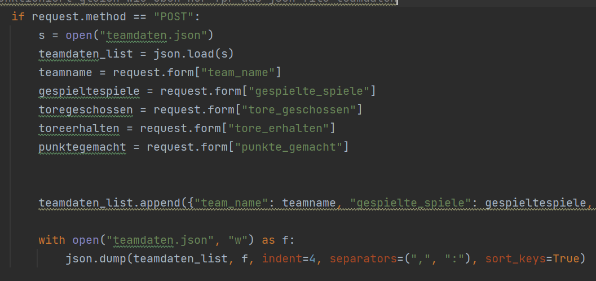
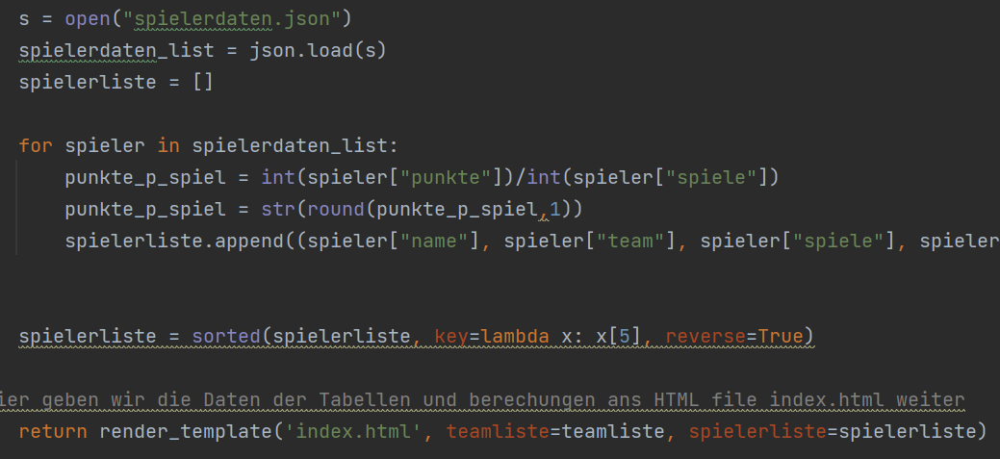
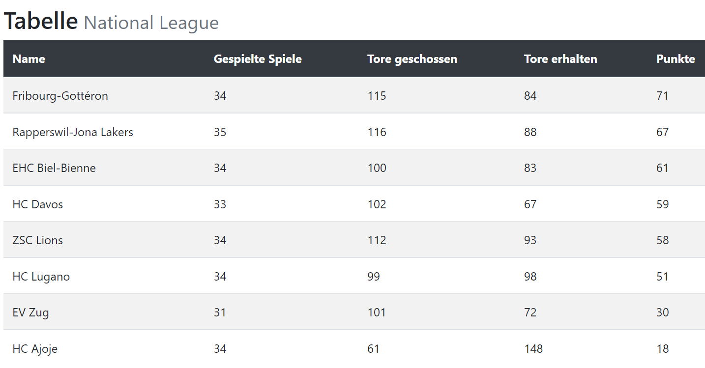
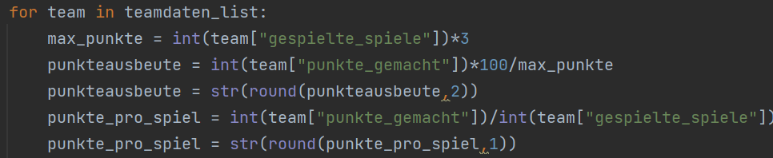

# PROG2

Verwendete programme und Sprachen:
- HTML
- Python
- Bootstrap (CSS)
- Flask
- JSON
- Git Bash

##Pojekt Hockeytabellen:
Im Projekt soll es möglich sein Hockeyteams und Spieler via Formular zu erfassen. 
Die eingetragenen Daten werden anschliessend in einem dazugehörigen JSON-File gespeichert.
Diese Spieler und Teams werden dann in Python in eine Tabelle konvertiert und in HTML wiedergegeben.
In Python werden die Daten zudem sortiert (nach Punkten). Des Weiteren werden 
noch zusätzliche Berechnungen gemacht. Diese Berechnungen werden in Standarttabellen nie gemacht, was mich nervt, deshalb habe ich sie hinzugefügt.
Mit Punkte pro Spiel kann man sehen wie viele Punkte ein Team im Durchschnitt pro Spiel macht.
Dies ist nützlich in Zeiten wie jetzt, da auf Grund von COVID-19 viele Teams eine verschiedene Anzahl gespielte Spiele hat.
Durch diese Angabe in der Tabelle sieht man welches Team aktuell am Besten unterwegs ist.
Bei der Punkteausbeute sieht man wie viel Prozent der maximal möglichen Punktzahl ein Team erreicht hat.
Bei den Spielern ist die Zusatzberechnung ebenfalls Punkte pro Spiel. Also wie viele Tore und Assists zusammen 
ein Spieler im Durchschnitt pro Spiel macht. Dies ist spannend, wenn ein Spieler zum Beispiel verletzt ist.
Dann erscheint er nie in einer Scorertabelle, obwohl er in Sachen Punkte pro Spiel gut dabei wäre
aber das er aufgrund der Verletzung Spiele verpasst hat, ist er in der Tabelle nicht zu sehen.

###Input durch Formular

###Output durch Tabelle

###Basic Berechnungen in Python

###Erfahrungen:
Python und HTML kannte ich schon. Beides in Kombination aber noch nicht.
Das war Anfangs eine Schwierigkeit. Dann kam noch JSON dazu. 
JSON ist ziemlich einfach zu verwenden und ich bin ein grosser Fan. 
Trotzdem hatte ich auch hier bei den Schnittstellen zu Python Probleme. 
Teilweise habe ich wohl graue Haare erhalten, als ich versuchte die Tabelle zu erstellen.
Eine Tabelle in HTML zu erstellen ist einfach. Eine Liste in Python zu erstellen ist einfach.
Daten in JSON zu speichern ist einfach. Doch all dies zu kombinieren bereitete mir Kopfschmerzen.
Oft lief es wie geschmiert und ich kam gut vorwärts. Doch dann, wie es beim Programmieren so ist, 
verbrachte ich Stunden einen Fehler zu finden. Der Debugger hilft in vielen Situationen
doch nicht immer. Und wenn nicht, gilt es zu googeln. Oft versucht man 10 verschiedene Lösungsansätze und der letzte funktioniert dann.
Stackoverflow und Quora waren mir oft eine grosse Hilfe.
Mit Github und Git Bash zu arbeiten fand ich super. Man hat dezentrale Backups der Arbeit 
auf die man immer zurückgreifen kann. Zudem muss man nicht an einen Abgabetermin denken. Sehr praktisch!
